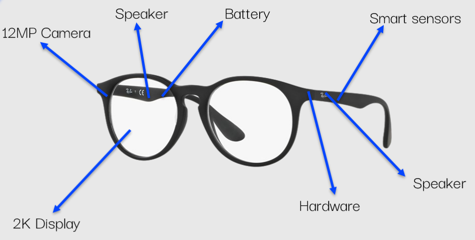

# Introducing Increasy, our first smart glasses made for children

Introducing Increasy, the world's first smart glasses for children, with a cool design!

This pair of smart glasses, will change how your child learn, study, and more! 

## Specifications

#### Sleek, intelligent design
This product has been designed to put everything as thin as possible, weighing and sizing equally to normal everyday glasses, which makes them very powerful. 

#### The lightweight vision, designed for everyday use
This pair of shades has a weight of 19 grams, lightweight compared to the average of 32 grams. 

## Features 

### Myopic support

Our smart glasses has special support lenses for children with eye problems like myopic. With our technology, we can help keep the eye balanced and the myopic level will stay the same. 
###### Not included with base model

